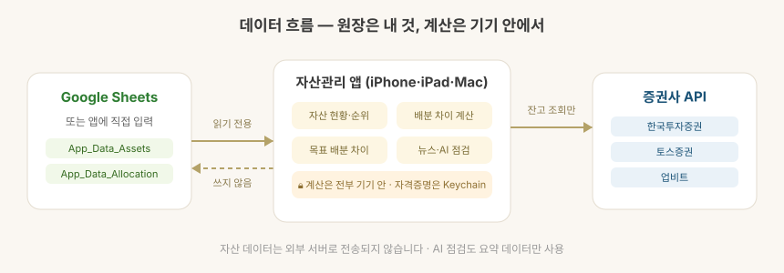

# GOLGORU — 골고루

> **내 자산을 골고루.**
>
> iPhone · iPad · Mac에서 쓰는 개인 자산관리 앱 —
> 흩어진 계좌를 한눈에 모으고, 목표 배분과의 차이를 계산합니다.

이름 그대로, 흩어진 계좌를 한눈에 모으고 목표 배분에 맞춰 자산을 **골고루** 나누는 앱입니다.

자산 데이터를 어디에 둘지는 세 가지 중에서 고릅니다 — 로그인 없이 **둘러보기**,
**앱에 직접 입력**, 또는 이미 쓰던 **Google Sheets 연동**.
어느 쪽이든 자산 데이터는 사용자 기기나 사용자 시트에 있고, 앱 제공자 서버에 저장되지 않습니다.

## 핵심 원칙

- **데이터는 사용자 것** — 앱이 데이터를 소유하지 않습니다. 기기 안 또는 사용자 시트에만 있고, 앱 제공자 서버에는 저장되지 않습니다.
- **기기 안 계산** — 자산 금액·환산·배분 계산은 모두 앱 내부에서 수행합니다. 자산 데이터가 외부 서버로 전송되지 않습니다.
- **읽기 전용 연동** — Google Sheets는 읽기 권한만 요청하고, 증권사는 잔고 조회만 합니다. 앱이 사용자의 시트를 고치거나 주문을 넣지 않습니다.

## 기능별 안내

| 기능 | 설명 |
| --- | --- |
| [시작하기](docs/getting-started.md) | 세 가지 시작 방식 · 시트 템플릿 · 증권사 자동 채우기 |
| [대시보드](docs/dashboard.md) | 총자산 · 현금 비중 · 카테고리 구성 · 시장지표 · 뉴스 요약 |
| [자산 구성 분석](docs/portfolio-analysis.md) | 투자 건강점수 · AI 인사이트 · 배당 · 자산 추정 · 목표 · 개선 제안 |
| [자산순위](docs/asset-ranking.md) | 계좌별·자산군별·종목별 순위 · 시세 자동 갱신 · 상세 차트 |
| [자산배분](docs/allocation-rebalancing.md) | 목표 비중 · 실제 비중 차이 · 조정 필요 금액 · 리밸런싱 계획과 체결 기록 |
| [뉴스 · 리포트](docs/news-reports.md) | 보유·관심 종목 뉴스 · 증권사 리포트 · 투자 이벤트 |
| [AI 자산 점검](docs/ai-review.md) | 자산 자동 분석 → 편중 진단 → 성향별 목표 제안 (기기 안 규칙 계산 · 외부 전송 없음) |
| [증권사 연결](docs/broker-connection.md) | 한투·업비트 잔고 조회 · 연결 확인 · 계좌 자동 채우기 |
| [데이터와 보안](docs/data-security.md) | 저장 위치 · Keychain · 앱 잠금 · 캐시 보호 |
| [개인정보처리방침](docs/privacy.md) | 다루는 정보 · 전송 범위 · 보관과 삭제 |
| [버전 기록](docs/changelog.md) | 어떤 기능이 어느 버전에 들어갔는지 |

## 지원 환경

- iPhone / iPad / Mac (SwiftUI 공용 코드베이스)
- 시작하는 데 필요한 것: 없음 (둘러보기·직접 입력) 또는 Google 계정 (시트 연동)
- 증권사 잔고 조회: 한국투자증권, 업비트 — 키를 넣으면 보유 종목을 자동으로 채웁니다

## 현재 상태

App Store 공개를 준비하고 있습니다.

- ✅ 자산 현황·순위·배분 차이·뉴스·AI 점검
- ✅ 자산 구성 분석 (건강점수·인사이트·배당·자산 추정·목표·개선 제안)
- ✅ 세 가지 시작 방식 (둘러보기 · 직접 입력 · 시트 연동)
- ✅ 증권사 잔고 조회와 계좌 자동 채우기
- 🔜 App Store 공개

## 브랜드

| 항목 | 값 |
| --- | --- |
| 브랜드 | GOLGORU |
| 앱 표시 이름 | 골고루 |
| 슬로건 | 내 자산을 골고루. |

---

*이 문서는 앱 기능이 바뀔 때마다 계속 업데이트됩니다.*
