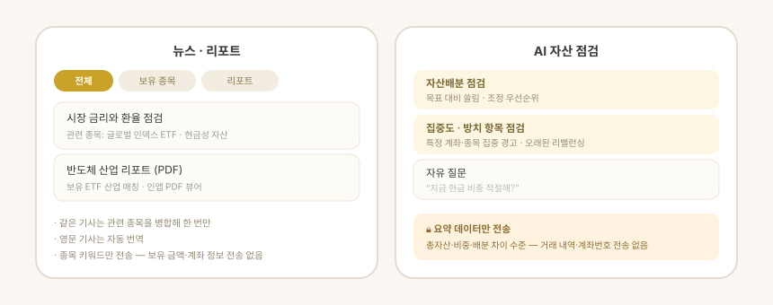

# 구상 — 살펴보기 · 짜보기

> **지원 방식:** 둘러보기 · 앱에 직접 입력

**구상** 탭은 둘로 갈립니다 — 지금 가진 자산을 살펴보고, 아직 사지 않은 구성을 미리 짜 봅니다.

| | 하는 일 |
| --- | --- |
| **살펴보기** | 지금 가진 자산을 자동으로 분석해 편중을 진단하고, 성향에 맞는 목표와 계좌별 조정안을 냅니다 |
| **짜보기** | 아직 사지 않은 구성을 미리 짜 봅니다 — ETF를 찾아 비교하고, 투자금을 넣어 주수를 보고, 남에게 넘깁니다 |
| **나눔터** | 짜보기 안의 탭입니다. 다른 사람이 짜 본 조합을 보고, 마음에 들면 내 짜보기로 가져옵니다 |

앱은 계산해 보여줄 뿐 **주문을 넣지 않습니다.** 매매는 사용자가 증권사에서 직접 합니다.

## 살펴보기 — 지금 가진 자산

숫자를 직접 설계하지 않습니다. **성향 하나만 고르고, 적용 · 수정 · 무시만** 하면 됩니다.

### 화면 순서

1. **자산 구성** — 입력 없이 보유 종목을 자산군(주식 · 채권 · 현금 · 코인 · 금)과
   국가(미국 · 한국 · 기타)로 자동 분류해 **도넛 하나와 색 점 범례**로 보여줍니다.
   해외 자산은 기준환율로 원화 환산해 비중을 냅니다. 나라별 비중은 **나라별로 보기**에서 봅니다.
2. **가장 먼저 볼 것** — 편중 · 부족 가운데 **가장 심한 하나만** 문장으로 크게 보여줍니다.
   나머지는 **다른 진단 N가지**로 접혀 있습니다.
3. **AI 목표 제안** — **어떻게 바꿀지 보기**를 눌러야 펼쳐집니다.
   투자 성향(보수 · 중립 · 공격) 칩을 바꾸면 목표가 통째로 다시 계산됩니다.
4. **계좌별 리밸런싱** — "무엇을 어느 계좌에서 얼마나 사고팔면" 목표에 가까워지는지,
   **자산군 → 계좌 → 종목(수량 · 분할 회차)** 순서로 제안합니다.

> **1.3.0에서 간결해졌습니다.** 같은 모양의 막대가 열다섯 줄 넘게 깔려 있던 것을
> 도넛 하나와 1순위 진단으로 줄이고, 나라별 비중 · 나머지 진단 · 목표 제안은
> 눌러야 열리게 바꿨습니다. 별점은 초보에게 읽히지 않아 **숫자와 기준을 문장으로** 풉니다.

### 목표를 적용한 뒤 — 모니터링

목표를 적용하면 화면이 **모니터링 모드**로 바뀝니다.

- 적용한 목표가 **기준선**이 되어, 이후에는 목표 대비 현재 비중을 비교해서 보여줍니다.
- **허용오차(±3 · 5 · 10%p)** 를 정하고, 그 범위를 벗어난 자산군만 조정 대상으로 잡습니다.
- 범위를 벗어난 곳만 **자동으로 펼쳐져** 국가 → 계좌 → 종목(수량 · 분할)까지 내려갑니다.
  범위 안은 `✓ 범위 안` 한 줄로 접힙니다.
- 상위(자산군)가 범위 안이어도 **그 안의 국가 비중이 틀어졌으면 펼쳐집니다**.
- `목표 수정`으로 목표만 바꾸거나, `목표 다시 받기`로 처음부터 새로 제안받을 수 있습니다.

### 목표 제안 방식

- **성향 칩**(보수 · 중립 · 공격)으로 목표를 고릅니다. 숫자를 직접 입력하지 않습니다.
- 목표는 **방어자산 하한(현금 · 채권)과 위험자산 상한(코인 · 금 · 단일 국가)** 같은
  일반적 분산 원칙에 비춰 제안하며, 주식 비중은 나머지로 자동 계산됩니다.
- **적용 / 수정 / 무시** 중에서 고릅니다. 수정하면 현금 · 채권 · 금 · 코인 목표를 직접
  조정할 수 있고, 나머지는 자동으로 다시 맞춰집니다.

### 리밸런싱 원칙

- **계좌 경계 안에서** 조정합니다 — 계좌 간 종목 이동 없이, 각 계좌의 자산으로만 사고팝니다.
- 한 종목에 몰아주지 않고 **여러 계좌 · 여러 종목에 비중대로 분산**합니다.
- 목표에서 줄이려는 자산군만 매도합니다(작은 차이는 매매하지 않는 허용오차 적용).
- 보유가 없는 자산군은 특정 종목을 찍어 추천하지 않고 **카테고리(예: 채권 ETF)로만** 안내합니다.

### 갱신 시점

- 툴바의 새로고침 버튼이나 **화면을 아래로 당겨** 진단을 다시 계산할 수 있습니다.
- 자산 데이터를 새로 읽으면 진단 · 목표 · 리밸런싱이 자동으로 다시 계산됩니다.
- 시세는 따로 갱신되지만 **목표 숫자는 시세가 움직일 때마다 흔들리지 않습니다** —
  자산 데이터를 새로 읽은 시점과 사용자가 새로고침한 시점을 기준으로 계산합니다.

## 짜보기 · 나눔터는 따로 적었습니다

구상 탭의 나머지 절반 — **짜보기**(아직 사지 않은 구성을 짜 보는 자리)와
**나눔터**(남이 짜 본 조합을 보는 자리)는 화면 그림과 함께
[짜보기 · 나눔터](portfolio-draft.html)에 따로 적었습니다.

## 안내

- 여기서 제시하는 목표 · 조정 · 비교는 **개인 맞춤 투자자문이 아니라 일반적 분산 원칙에
  비춘 참고치**입니다. 최종 판단과 주문은 사용자가 직접 합니다.
- 부동산(집 · 전세보증금 등)은 리밸런싱 대상에서 제외하고 참고로만 표시합니다.
- 지난 성과는 미래 수익을 보장하지 않습니다.

## 프라이버시 원칙

- **자산 정보가 기기 밖으로 나가지 않습니다.** 진단 · 목표 · 리밸런싱과 짜보기의
  주수 · 합성보수 · 지난 성과 계산은 전부 앱 안에서 처리하며, 이 화면은 외부 AI(LLM)를
  쓰지 않습니다.
- ETF를 찾고 비교할 때 밖으로 나가는 것은 **검색어와 종목 심볼**뿐입니다 —
  투자금 · 비중 · 보유 자산은 보내지 않습니다.
- 공유 링크의 구성은 주소의 `#` 뒤에 실려 **서버로 전송되지 않습니다.**
- 살펴보기는 **오프라인에서도 그대로 동작**합니다(짜보기의 종목 검색과 시세는
  네트워크가 필요합니다).
