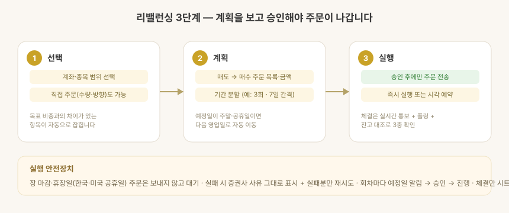

# 자산배분 · 리밸런싱

목표 자산배분과 실제 보유의 차이를 계산하고, 그 차이를 메우는 주문을 실행하는 화면입니다.

## 자산배분 차이

- 계좌·종목별 **목표 비중 대비 실제 비중**과 조정 필요 금액을 보여줍니다.
- **목표 비중 편집** — 앱에서 계좌별 목표 비중을 직접 수정하면 원본 시트에 반영됩니다
  (합계 100% 강제).
- 최근 리밸런싱 일자를 함께 표시해 오래 방치된 항목을 찾기 쉽습니다.

## 리밸런싱 실행 — 3단계

### 1단계 · 선택

리밸런싱할 계좌·종목 범위를 고릅니다. 목표 비중과 차이가 있는 항목이 자동으로 잡히고,
특정 종목 직접 주문(수량·방향 지정)도 여기서 진입합니다.

### 2단계 · 계획

매도 → 매수 순서의 주문 목록과 예상 금액을 확인합니다.
기간 분할(예: 3회차 · 7일 간격)을 선택하면 회차별 일정이 표시되고,
**예정일이 주말·공휴일이면 자동으로 다음 영업일로 밀립니다**(한국·미국 휴장일 모두).

### 3단계 · 실행

사용자가 확인한 뒤에만 주문이 나갑니다. 즉시 실행 대신 시작 시각을 예약할 수도 있습니다
(예정 시각 알림 → 승인 → 실행). 실행 중에도 남은 주문을 언제든 취소할 수 있습니다.

## 일괄 비중 조절

여러 계좌의 보유 종목을 **같은 비율로 한 번에** 줄이거나(축소 매도) 늘립니다(확대 매수).
예: 전 계좌 주식 비중을 10% 축소. 화면 흐름은 리밸런싱과 같습니다
(선택 → 계획 → 확인·예약 → 실행). 실행도 같은 엔진을 써서 회차 분할·예약·시트 기록·안전장치가
리밸런싱과 동일하게 동작합니다.

## 실행 안전장치

| 장치 | 동작 |
| --- | --- |
| 장 시간·휴장일 검사 | 닫힌 시장(장외·주말·공휴일) 주문은 보내지 않고 대기. 열린 시장만 진행 |
| 회차 대기 | 분할 회차마다 예정일 알림 → 승인 후 진행 |
| 실패 처리 | 증권사가 준 거부 사유를 그대로 표시, 실패분만 재시도 |
| 체결 확인 | 실시간 체결통보(WebSocket) + 폴링 + 잔고 대조 3중 확인 |
| 기록 | 체결된 주문만 시트에 자동 기록, "원장 반영"으로 수량·평단·현금 갱신(승인 방식) |
