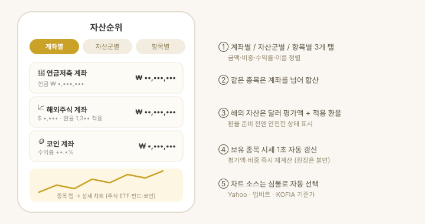

# 자산 · 종목 상세

> **지원 방식:** 둘러보기 · 내 자산 넣기

무엇을 얼마나 갖고 있는지와, 목표 비중에서 얼마나 벌어졌는지를 **한 화면**에서 봅니다.
예전에는 「자산순위」와 「자산배분」 두 화면이 같은 목록을 각각 보여 줬는데,
숫자 열만 달라서 어느 쪽을 봐야 하는지 알기 어려웠습니다.

## 화면 구성

1. 위쪽에 **합계와 수익**이 한 줄로 나옵니다.
2. **계좌별 / 항목별** 보기를 고릅니다.
   계좌별은 계좌로 묶고, 항목별은 종목을 평평하게 펼칩니다 —
   같은 종목이 여러 계좌에 있으면 항목별에서는 하나로 합치고 담긴 계좌를 적습니다.
3. 정렬은 **금액순 · 수익순 · 이름순** 셋입니다.
   같은 항목을 다시 누르면 오름차순으로 뒤집힙니다.
4. 목표와 벌어진 계좌 · 종목에는 이름 옆에 **`+5.0%p`** 같은 배지가 붙습니다.
   문턱은 설정 > 내 자산 > **조정 기준**에서 정하고, 앱 전체가 그 값 하나를 씁니다.
5. 목록 위의 **조정안** 줄을 누르면 [무엇을 얼마나 옮길지](allocation-rebalancing.md)를 봅니다.

행을 누르면 계좌 상세로 들어갑니다. 거기서 **편집**을 누르면 수량 · 평단 · 목표 비중 ·
현금을 고치고, 종목을 누르면 시세와 차트를 봅니다.

> 맥 · 아이패드에서는 계좌가 **펼쳐진 채로** 나란히 놓입니다. 눌러 들어가지 않습니다.

## 동작 방식

- **합산 규칙** — 같은 종목은 계좌를 넘어 합산하고, 현금성 자산도 하나로 합산합니다.
- **시세 자동 갱신** — 앱을 보고 있는 동안 보유 종목 시세를 60초마다 갱신합니다.
  화면을 아래로 당기면 주기와 무관하게 즉시 받고, 보유 종목의 시장이 모두 닫혀 있으면
  값이 변하지 않으므로 갱신하지 않습니다(코인은 24시간 계속 갱신).
  평가액·비중은 바로 재계산되지만 원장의 평단·수량은 바뀌지 않습니다.
- **차트 소스 자동 선택** — 한국 상장 코드·거래소 접두사는 Yahoo Finance(.KS/.KQ 폴백),
  영문 티커는 업비트 KRW 마켓(코인), 펀드 표준코드(K+11자)는 KOFIA 기준가.
- **USD 자산** — 원본 달러 평가액, 적용 환율, 앱 계산 원화액을 함께 표시합니다.
  환율이 아직 없으면 0으로 잡는 대신 안전한 상태 표시로 알려줍니다.

## 종목 상세 — 차트 · 분석 · 뉴스 · 메모

종목을 탭하면 이름·현재가 아래 네 탭이 열립니다.

- **차트** — 캔들/선 전환, 이동평균 5 · 20 · 200, 매물대. 기간 버튼은 없고 **좌우로 밀어**
  지난 구간을 보고, 두 손가락으로 벌리면 확대됩니다. 소스는 위 "차트 소스 자동 선택"과 같습니다.
- **분석** — 이미 받은 시세로 계산하는 기술 지표와 재무제표입니다.
  - **기술 지표** — 가격 위치 · 이동평균 배열 · 이격도 · 기간 수익률 · 연 변동성 · 최대 낙폭 · 거래량 비율.
    값을 낼 수 없으면 그 줄을 숨깁니다(0으로 채워 거짓 정보를 만들지 않습니다).
  - **요약** — 지표를 관측만 서술하는 규칙 기반 문장입니다(즉시·오프라인, 매매 판단 문구 없음).
  - **재무제표** — 손익 · 재무상태 · 현금흐름을 연간/분기로 봅니다.
    해외는 SEC EDGAR, 국내는 네이버 증권 + DART 공시에서 가져옵니다(모두 무료·키 불필요).
  - **ETF** — 재무제표 대신 보수 · 기초지수 · 순자산 · 구성종목 상위 · 업종 비중을 보여줍니다.
  - **수급** — 외국인 보유율과 최근 30거래일 외국인 · 기관 일별 순매수를 막대로 보여줍니다
    (0선 위가 순매수, 아래가 순매도). 출처는 네이버 증권입니다.
  - **주주** — 최대주주 및 특수관계인 지분율과 국민연금 등 5% 이상 대량보유 현황입니다.
    출처는 DART 공시라 **보고 시점 기준**이며 현재 지분과 다를 수 있습니다.
    수급 · 주주는 **국내 상장 종목만** 제공합니다 — 외국인/기관 구분과 대량보유 공시가
    한국 시장 제도라 해외 종목에는 카드가 나타나지 않습니다.
- **뉴스** — 해당 종목 관련 뉴스([뉴스 · 리포트](news-reports.md)와 같은 소스).
- **메모** — 종목별 매매 기록입니다. 왜 샀는지 · 손절 라인 · 지켜볼 것을 날짜를 달아 남깁니다.
  날짜는 직접 고를 수 있어 지난 매매도 뒤늦게 적을 수 있고, 적은 메모는 수정 · 삭제됩니다.
  **체결가 · 목표가 · 손절가**를 함께 적을 수 있습니다. 평단 · 현재가가 위에 표시되고
  버튼 한 번으로 체결가에 넣을 수 있으며, 목표 · 손절은 가격 대신 **%로 입력**해도 됩니다
  (기준은 평단, 보유가 없으면 현재가 — 저장은 환산한 가격으로 합니다).
  적어 둔 목표 · 손절은 목록에서 **현재가 대비 남은 거리(%)** 와 함께 보이고, 닿으면
  "도달" · "이탈"로 강조됩니다. **차트에도 목표 · 손절선**이 평단선과 같은 점선으로 그려집니다
  (메모가 여러 건이면 목표는 가장 높은 값, 손절은 가장 낮은 값 하나씩). 설정 > 앱에서 **목표 · 손절 알림**을 켜면 시세가 닿을 때
  알려 줍니다(시세는 앱이 켜져 있을 때만 들어오므로 앱을 보고 있는 동안 울립니다).
  메모는 **기기 안에** 보관되며 "캐시 지우기"로는 지워지지 않고, iCloud 로 내 기기끼리
  공유됩니다.

차트에는 **평단선**이 함께 그려집니다. 원장의 수량 · 단가로 계산한 매수 평균가를
청록 점선으로 얹어, 지금 가격이 내 평단 위인지 아래인지 바로 보입니다. 같은 종목이 여러
계좌에 나뉘어 있으면 수량 가중 평균을 씁니다. 원장 통화가 차트 통화와 다르면 그리지
않습니다(환산해서 그리면 실제와 어긋납니다). 평단과 평단 대비 등락은 **내 보유** 카드에도
숫자로 나옵니다.
