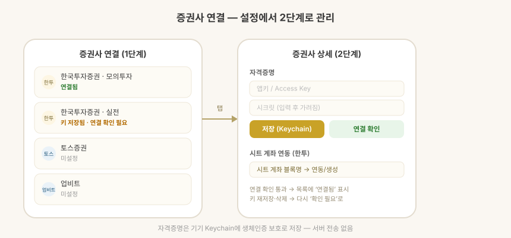

# 증권사 연결

> **지원 방식:** 앱에 직접 입력 · Google Sheets 연동

> 증권사 연결은 **잔고를 읽어오는 용도**입니다. 이 앱은 주문을 넣지 않습니다.

설정 → **증권사 연결**에서 여러 증권사 연동을 한 곳에서 관리합니다.

## 연결 절차 (공통)

1. **키 저장** — 증권사에서 발급한 API 키를 입력하면 기기 Keychain에
   생체인증(Face ID/Touch ID) 보호로 저장됩니다. 서버에 올라가지 않습니다.
2. **연결 확인** — 실제 API 호출로 키가 유효한지 즉시 테스트합니다.
3. 연결 확인을 통과해야 목록에 **연결됨**으로 표시됩니다.
   키를 새로 저장하거나 삭제하면 다시 확인 전 상태로 돌아갑니다.

| 상태 | 의미 |
| --- | --- |
| 미설정 | 키 없음 |
| 키 저장됨 · 연결 확인 필요 | 키는 있지만 연결 테스트 미통과 |
| 연결됨 | 연결 확인 성공 |

## 지원 증권사

| 증권사 | 연결 확인 방식 | 잔고 조회 |
| --- | --- | --- |
| 한국투자증권 | 토큰 발급 | ✅ 보유 종목·평단·예수금 |
| 업비트 | 계좌 조회 (JWT 서명) | ✅ 코인 보유·KRW 예수금 |
| 바이낸스 | 계좌 조회 (HMAC 서명) | ✅ 코인 보유 |
| 토스증권 | OAuth2 토큰 발급 | 🔜 준비 중 |

업비트·바이낸스 연결 확인은 키에 등록된 IP에서만 성공합니다.

한 계좌에 업비트·바이낸스가 함께 연동돼 있으면, 한쪽을 가져올 때 다른 거래소의
보유 코인을 0으로 밀지 않도록 서로의 보유 종목을 보호합니다.

## 잔고로 계좌 채우기

증권사 키를 연결하면 보유 종목을 하나씩 입력하는 대신 잔고를 읽어 계좌를 채울 수 있습니다.

**앱에 직접 입력** 방식에서는 계좌·종목 편집 화면에서 계좌마다
**증권사에서 가져오기**를 누릅니다. 보유 종목과 예수금이 잔고에 맞춰지고,
증권사에 없어진 종목은 수량 0으로 남고 새로 생긴 종목은 자동으로 추가됩니다.

**Google Sheets 연동** 방식에서는 앱이 시트를 읽기만 하므로,
잔고를 확인한 뒤 시트를 직접 수정하세요.

### 한투 계좌 탐색

한투는 앱키 하나로 같은 종합계좌의 상품코드 계좌들
(위탁 01 · 연금저축 22 · 퇴직연금 29 …)을 전부 조회할 수 있습니다.
"계좌 탐색"을 누르면 상품코드를 순회해 존재하는 계좌를 모두 나열합니다.

업비트는 키당 계좌가 하나라 단일 연동을 사용합니다.

## 안전

- API 키는 기기 Keychain에만 저장되며 앱 제공자 서버로 전송되지 않습니다.
- 증권사 서버와의 통신은 기기에서 직접 이루어집니다.
- 계좌번호와 토큰은 화면과 로그에 마스킹되어 표시됩니다.
- 잔고를 가져오면 기존 원장을 덮어쓰므로, 반영 전에 변경 내용을 확인할 수 있습니다.
