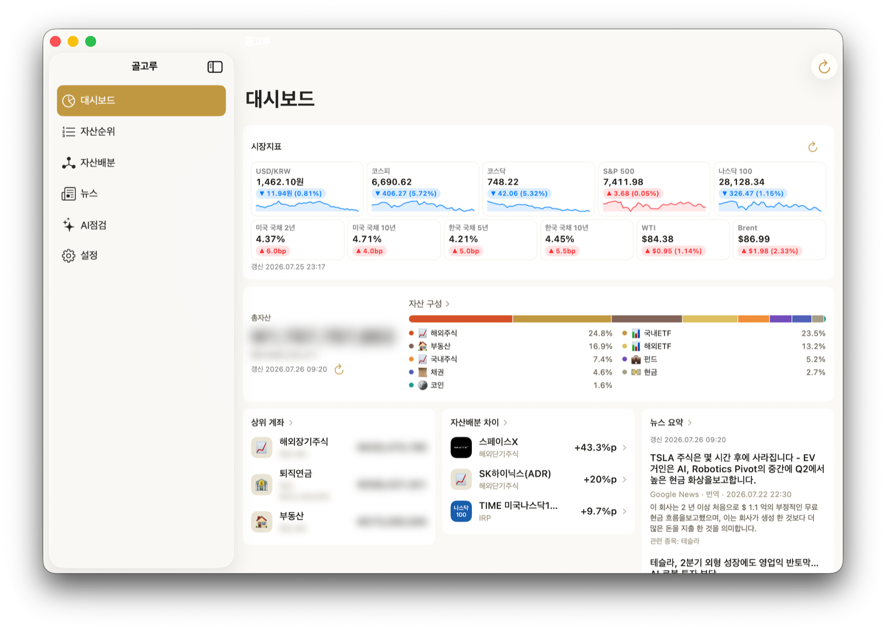

# 대시보드

> **지원 방식:** 둘러보기 · 앱에 직접 입력 · Google Sheets 연동

앱을 열면 가장 먼저 보이는 화면입니다. 전체 자산 상태를 30초 안에 파악하는 것이 목표입니다.

## 화면 구성

1. **총 자산 · 현금 비중** — 전체 자산과 현금성 자산 비율.
   시트 연동이든 앱 직접 입력이든 같은 화면으로 보여줍니다.
2. **카테고리 구성** — 주식/ETF · 펀드 · 코인 · 현금 · 부동산 · 저축 · 채권별 비중 바.
   탭하면 [자산 구성 분석](portfolio-analysis.md)(건강점수·인사이트·배당·추정)으로 들어갑니다.
3. **시장지표** — 환율·금리·유가·주가지수 11종: USD/KRW, 미국 국채 2년·10년,
   한국 국채 5년·10년, WTI·브렌트유, 코스피·코스닥·S&P500·나스닥100.
   주가지수·환율에는 최근 추이 스파크라인이 함께 표시됩니다.
   일부 지표가 실패해도 성공한 지표만 갱신되고 실패분은 마지막 정상값을 유지합니다.
4. **자산배분 차이 상위 항목** — 목표 비중과 가장 벌어진 항목. 탭하면 자산배분 화면으로 이동.
5. **계좌별 자산 순위 상위 3개** · **오늘의 뉴스 요약** — 각 섹션 헤더 탭으로 해당 탭 이동.

## 알아두면 좋은 것

- USD 자산의 원화 환산은 시장지표의 USD/KRW 값으로 **앱 안에서만** 계산합니다.
- 금액은 눈 아이콘으로 가리거나 표시할 수 있습니다(스크린샷·공공장소 대비).
- 화면 모드는 설정에서 **밝게 · 어둡게 · 시스템 설정 따름** 중에 고를 수 있습니다.
