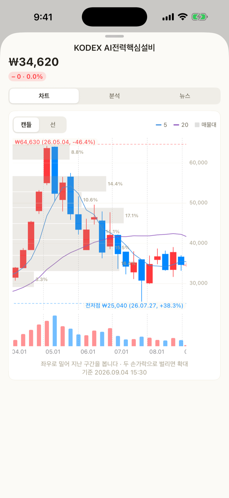

# Build · Community

**Build** is the third tab along the bottom. It is not where you look at what you already own —
it is where you put together **a mix you have not bought yet**. Open the tab and the portfolios
you have made are right there, with the segment at the top splitting **My portfolios** from
**Community**.

| Segment | What it holds |
| --- | --- |
| **My portfolios** | The ones you made. You build, edit and add them to your assets here |
| **Community** | Ones other people built. Copy any you like into your own list |

> **2.0 took out the nested segments.** It used to be “Plan” containing “Look | Build”, and that
> split again into “My builds | Community” — three segments stacked. Now there is **one layer**,
> in the same place and the same shape as “By account | By holding” on the Assets tab.

> **Asset-class diagnosis and target suggestions are gone** (2.0). Target amounts live in
> settings, and target weights and the gap to them live on the Assets tab.

> **Nothing about your assets leaves the device.** Share counts, blended fees and past
> performance are all worked out inside the app. The only things that go out are the
> **search text and ticker symbols** used to find a holding and fetch its price.

## Build — a mix you have not bought yet

> **Available from 1.3.0.** It became a tab of its own in 2.0.

Until then the app only showed you **what you already own**. Even once you decide “I want the
Nasdaq 100”, TIGER, KODEX, ACE and RISE each have their own version, with hedged and
covered-call siblings on top, and there was nowhere to put them side by side. Build is that place.

**None of this is a real holding yet.** Until you add it to your assets, the screen says so:
“not in your assets yet”.

### 1. Make the portfolio first

Tap **New portfolio** below the list, give it a name and pick **which market to pick from**
(Korea · US · both), and you get an empty one. The market **cannot change once created.**
You can add holdings there and then with **Add holdings**, or come back and add more
**as often as you like** — Nasdaq 100 first, bonds and dividends later.

> **The screen never calls this an account.** It is not a real brokerage account, and calling
> it one would only confuse things. An account with the same name appears the moment you tap
> **Add to my assets** — and the button says so before you tap it.

**My portfolios** is home. Each row has a weight bar and a legend (up to five entries), with
**market · expected distribution · total fee · number of holdings** on one line underneath, and
an **Added to my assets** badge next to the name once it has gone in.
The four row actions (rename · share · duplicate · delete) are **a swipe to the left on iPhone**
and **the ⋯ menu on Android** — each platform has its own standard.
Duplicate is for “the same mix, but let me try the hedged version too”.
Renaming **clears the added badge** (assets already added keep the old name).

The detail screen is **view by default, edit as a mode**. Changes are only kept when you tap
Save in edit mode; to drop them, swipe the sheet down. Deleting a portfolio **does not remove
assets you already added.**

### 2. Find holdings

The search screen splits into two columns: **ETFs** and **single stocks**.

- **ETFs** — candidates are **grouped by issuer** (TIGER → Mirae Asset, KODEX → Samsung,
  ACE → Korea Investment, RISE → KB …). Type badges are read out of the name.
- **Single stocks** — SK Hynix, Tesla and the like. There is no issuer, so they are
  **grouped by exchange** (KOSPI · KOSDAQ · NASDAQ · NYSE).
  ETFs do not show up in this column — the other one is already looking for them.

Both columns pick and add the same way.

| Badge | What it means |
| --- | --- |
| Hedged | Offsets currency moves |
| Covered call | Sells calls to raise the distribution |
| Leverage · Inverse | A multiple of the index · the opposite direction |
| Monthly | Distributes every month |
| TR | Reinvests the distribution |

### 3. Put them side by side

Pick up to five and go to **Compare**. Rows are the figures, columns are the ETFs — on iPhone
you swipe sideways (Mac and iPad show them all at once).

| Compared |
| --- |
| Total fee · distribution yield · net assets · tracking error · base index |

- **Sorting** is lowest fee or highest distribution. The app does not score them and rank them for you.
- Pick exactly **two** and it also works out **how much their top holdings overlap**.
  The source only gives the top 10, so it is **not the full overlap but the overlap within that
  range** — and the screen says so.
- Pick a period and the **return curves** are drawn on top of each other.
- Tick rows in the table and tap **Add**. Added holdings **split the weight evenly**, and you
  can change that in edit mode.

US holdings have no tracking error at the source, so that row is blank. Nothing is broken.

### 4. Try an amount

Put in the weights and an amount, and it works out on the spot:

- **Shares** per holding and the **leftover cash**
- The **blended fee** (with how much of the mix that figure covers)
- **Blended sector weights** (information technology · financials … largest first)

The amount is **in won only**, and US holdings are converted at today's rate (the rate used is
shown on screen). Rows with no price or no exchange rate, and rows whose weight does not buy
even one share, **each say why on the row.**
The amount field adds separators as you type, and reads the figure back underneath in the
Korean 억 · 만 units (100 million · 10 thousand won) — `300,000,000` alone does not say at a
glance whether it is 300 million or 3 billion.

### 5. See how it has gone since you built it

> **Available from 2.4.0.**

**Since you built it — from the day you made it** sits at the top of the detail screen. It
**pins the start date to the day the portfolio was made** and counts only from there. It is
measured against the indices (KOSPI 200 · S&P 500) over the same span, so you can see whether
you are ahead or behind.

**This is not the same thing as “past performance” below.** Past performance looks backwards
**after** you picked a mix you liked, so it usually looks good — the span was yours to choose.
Since you built it is a span you cannot choose, so there is nothing to inflate. That is why it
sits on top.

The figure **shows before 90 days too, but in small type**, with “still short”. A ten-day swing
is mostly the market moving, not skill — one portfolio actually flipped from ahead of the index
to behind it and back inside six days.

The maths assumes you **bought at the weights on the day you built it and left it alone**. It
does not assume any rebalancing along the way. Distributions are included (adjusted prices).

### 6. Look back at how it would have done

Open **Past performance — if you had held this** in the detail screen and the mix is replayed
against historical prices: **cumulative return, annualized return and max drawdown**, with a
curve. You choose the period.

**It is not a forecast.** It is what already happened, recalculated for this mix, and the screen
says as much. Spans **shorter than 90 days are not calculated**, and **spans shorter than a year
get no annualized return.**

### 7. Hand it to someone

**Share** in the detail screen sends it three ways. This is a different thing from posting to the
community — this goes only to the people you choose.

| Way | What they get |
| --- | --- |
| Link | Opens the app; anyone without the app sees it on a web page |
| Code | A short string starting with `v1.`. They paste it into **Import with a code** on the Build tab |
| Picture card | One 4:5 image with the weights and past performance on it |

Whichever way you send it, **the amount does not go with it** — only the holdings, weights and name.

Every sheet closes by **swiping down** (2.0) — the handle at the top is the way. There are no
separate “Done” or “Close” buttons.

The mix rides in the link after the `#`. **URL fragments are never sent to a server**, so it is
neither stored nor left in any access log.

The picture card **cannot be tapped through**, so the actual link goes along with it as text.
If the portfolio is posted to the community it goes straight to that post (which opens without
the app); if it is not, it goes to the Golgoru home page. Sharing never quietly posts anything.

Whoever receives it sees the holdings by name first, names it, and has to tap **Save to my
portfolios** for it to join their list. A code from someone else is not taken at face value —
the app re-checks every value's range.

### 8. Add it to your assets when you like it

**Add to my assets** turns it into a real account. It is the main action on this screen, so it is
a filled gold button; posting to the community and sharing are outlined.

- **A copy goes in** — editing the portfolio afterwards does not change your assets.
- It becomes **one account** with the portfolio's name. That is written under the button before you tap.
- Once added it is marked **Added to my assets**, so you cannot add it twice by accident.
- **Rows whose quantity came out 0 for want of a price are left out.** If every row is 0 the
  button will not press at all — clearing out rows without putting new ones in would wipe the
  assets you entered yesterday.
- If an account with that name already exists, **only the rows this feature added** are replaced
  with the new contents. Anything you entered by hand stays.

## Community — portfolios other people built

> **Available from 1.4.0.** It became a segment in 2.0.

Sharing in 1.3.0 only travelled **between people who had the link**. The community is where you
find portfolios from people you do not know. Tap the **Community** segment at the top of the
Build tab and it is there — no screen is pushed, so there is nothing to come back from.

Codes come in through the **Import with a code** button under **My portfolios**. Both bring in
someone else's mix, but one is browsing a list and the other is pasting in a string you were sent.

### Tap a holding and its chart opens

> **Available from 2.3.0.** It works in both Build and the community.

To see what you are taking before you take it, you need each holding's price. Tap a holding row
in a portfolio and **the very screen you get on the Assets tab** opens — candles, moving
averages, volume, volume by price, previous highs and lows, analysis and news.

Since you do not own it yet, there are **no holding, adjustment or note sections.** Those three
only mean something for holdings in your own ledger.

**It is not a message board.** What goes up is not a post, it is one portfolio.

| Goes up | Does not |
|---|---|
| Holdings and weights | **Amount, shares, value** |
| The portfolio's name | Text, comments, photos |
| The market (Korea · US · both) | Account, email, device details |

Whoever posted it shows up under a name like `돌돌이#4821`. **They do not choose it** — the app
makes it on the device, so nobody can post whatever they like as a name.

### Counted from the day it was posted

> **Available from 2.4.0.**

The big number on a community card used to be “past performance” — **a backward look taken
after the poster had picked the mix**. People post mixes that look good, so that number was
always large: across the 25 portfolios actually up there, it averaged **+151%**.

Now that spot shows **how it has actually gone since it was posted**. The start date is pinned to
the day it went up and only the span after that is counted, side by side with the index over the
same span. For those same 25, the average since posting was **−1.3%**.

- **One line in the list** — “4 months since posted +6.4% · +1.8%p vs the index”
- **Everything in the detail** — the index, the span actually measured, and the original
  backtest kept below for reference
- **Before 90 days it is in small type** with “still short”
- It is recounted once a day, after the market closes

**Nothing is ranked by performance.** Ranking makes luck over a short span look like skill.
Past performance does not guarantee anything, and none of this is a recommendation.

### Look, copy, report

- **Looking** — the filter on the left (all · mine) and the sort on the right (recommended ·
  newest) are **two dropdowns**. The only segment is the one at the top.
  Tap a portfolio and you get the holdings and weights, **two doughnuts** for exposure and
  spread (country · asset class), and “last year” performance. You can see what you would be
  exposed to, and how much, before you take it.
  All of it is **as of when it was posted**, and none of it guarantees anything.
- **Copying** — tap “Copy into my portfolios” and you get **the same confirmation screen as a
  shared link**. It joins your list once you save, and nothing goes into your assets on its own.
  If it is already in your list the button reads **In my list**.
- **Posting** — “Post to the community” in your own portfolio's detail. You are shown what goes
  up and what does not first. You can post up to three a day, and you can take your own down
  whenever you like.
- **Reporting** — anything inappropriate can be reported, and once several people report it, it
  stops showing in the list.

### You can look without the app

[Portfolios people have built](../../c/) opens straight in a browser, no install needed.
