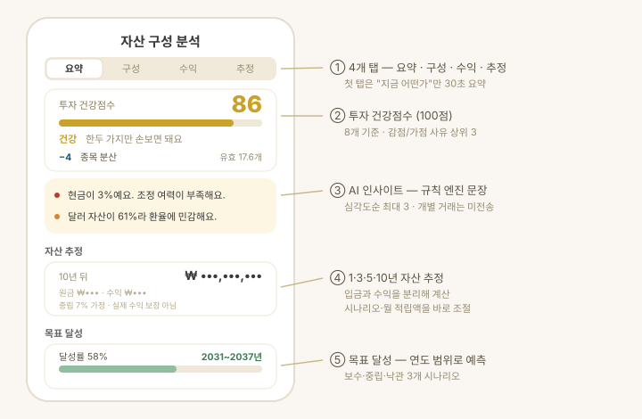
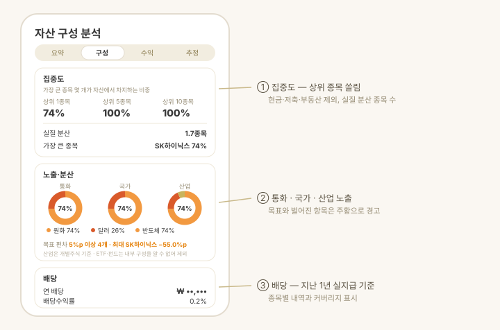

# 구성 리포트

> **지원 방식:** 둘러보기 · 앱에 직접 입력

홈의 총자산 카드에서 **자세히 보기**를 누르면 열리는 화면입니다. 단순 조회를 넘어
**"내 자산은 건강한가?"** 와 **"다음에 무엇을 해야 하는가?"** 에 답하는 것이 목표입니다.

화면은 네 개 탭으로 나뉘고, 첫 탭(요약)은 지금 상태를 30초 안에 파악하도록 구성됩니다.

| 탭 | 담는 내용 |
| --- | --- |
| **요약** | 투자 건강점수 · 눈에 띄는 것 · 전체 평가손익 |
| **구성** | 집중도 · 국가·산업 배분 · 배당 · 종류별 상세 |
| **수익** | 기간 수익 · 최대 낙폭 · 투자 성향 · 종목 손익 |
| **추정** | 1·3·5·10년 자산 추정 · 목표 달성 · 개선 제안 |

## 투자 건강점수

포트폴리오를 **100점**으로 채점하고, 점수를 깎거나 올린 사유 상위 3개를 함께 보여줍니다.

- **8개 기준** — 종목 분산 · 자산군 분산 · 현금 비중 · 통화 분산 · 수익률 · 변동성 · 목표 비중 준수 · 목표 진척.
- **분산은 개수가 아니라 쏠림으로 잽니다.** 균등하게 나눈 10종목과 "한 종목 90% + 9종목"은
  같은 점수를 받지 않습니다(유효 종목 수).
- **데이터가 없는 기준은 빼고 정규화합니다.** 총자산 기록이 아직 없다고 점수가 깎이지 않습니다.
- **구조적 위험은 상한으로 막습니다.** 한 종목이 30%를 넘으면 다른 기준이 만점이어도 총점이 제한됩니다.
- **기록이 며칠 안 되면 그렇게 적습니다.** 총자산 기록이 없으면 변동성·낙폭이 만점 합계에서
  아예 빠져 처음 며칠은 기준이 다릅니다 — 말해 주지 않으면 「어제 80, 오늘 72」가 됩니다.

## 눈에 띄는 것

지표를 종합해 지금 눈에 띄는 것을 문장으로 짚어줍니다.

- 규칙 엔진이 심각도 순으로 **최대 3개** 문장을 만들고, 같은 종류(집중도·현금 등)는 하나만 냅니다.
- 예: *"현금이 3%예요. 조정 여력이 부족해요." · "상위 3개 종목이 전체의 52%예요."*
- **앱 안의 규칙 엔진**이 만듭니다 — 공개 앱은 외부 AI를 호출하지 않고, 자산 정보가
  기기 밖으로 나가지 않습니다(자세한 원칙은 [데이터 · 보안](data-security.md)).

## 집중도 · 국가 · 산업 · 배당

- **집중도** — 가장 큰 종목 몇 개가 자산에서 차지하는 비중입니다.
  *상위 1종목 12% · 상위 5종목 42% · 상위 10종목 61%* 처럼 읽습니다(한 종목이 12%, 큰 5종목이 42%).
  함께 표시되는 **실질 분산**은 *"비중을 고르게 나눴다면 몇 종목에 나눈 셈인가"* 를 뜻합니다
  (클수록 잘 분산됨 — 한 종목에 몰릴수록 종목 수가 많아도 이 값은 작아집니다).
  현금·저축·부동산은 빼고 사고팔 수 있는 종목만 계산합니다.
- **국가 배분** — 상장 거래소로 판별합니다. 단, ETF는 상장 국가가 아니라 **투자 대상**으로 봅니다
  (예: 한국 상장 미국 지수 ETF는 미국으로 분류).
- **산업 배분** — 개별주식의 업종으로 분류합니다. ETF·펀드는 내부 구성을 알 수 없어 빠지므로,
  **몇 %를 기준으로 잰 값인지 커버리지를 함께 표시합니다**.
- **배당** — **지난 12개월 실지급 배당** 기준의 예상 연 배당과 배당수익률입니다(미래 예측 아님).
  배당 정보가 있는 종목만 세고, 수익률의 분모도 그 종목들의 평가액이라 커버리지를 함께 보여줍니다.

## 자산 추정 · 목표 달성

- **1·3·5·10년 추정** — 현재 자산과 월 적립액으로 미래 자산을 계산합니다.
  각 시점에 **원금(현재+적립)과 수익 기여를 나눠** 보여줘 복리 효과를 체감할 수 있습니다.
- **입금과 수익을 분리합니다.** 자산 증가에 섞인 입금을 걷어낸 순수 수익률만 성장에 반영해,
  적립을 성장으로 착각하지 않습니다.
- **시나리오와 월 적립액을 바로 조절**하면 네 시점 숫자가 즉시 바뀝니다(보수 4% · 중립 7% · 낙관 10%).
- **목표 달성** — 설정 > 내 자산 > 목표 자산에서 목표 금액(또는 FIRE 목표)을 넣으면 달성률과 예상 도달 시점을
  **연도 범위**로 보여줍니다("2031~2037년"). 목표일을 정하면 진척이 건강점수에도 반영됩니다.
- 모든 추정은 가정에 따른 계산이며 실제 수익을 보장하지 않습니다.

## 개선 제안

- 자산군 비중이 **가드레일**(현금 하한, 단일 종목·자산군·코인 상한)을 벗어나면 되돌리는
  최소 조정을 제안합니다.
- **적용했을 때의 건강점수**를 함께 보여줍니다("83점 → 89점").
- 담을 곳이 없으면 팔라고 하지 않습니다 — 갈 곳 없는 매도로 현금만 쌓이는 조언을 하지 않습니다.
- 계좌·종목별 차이는 [조정안](allocation-rebalancing.md)에서 이어서 확인합니다. 실제 매매는 사용자가 증권사에서 직접 합니다.

## 알아두면 좋은 것

- 배당·국가·산업은 하루 한 번 종목 정보를 받아 캐시합니다. 앱을 처음 켜면 잠시 뒤 채워집니다.
