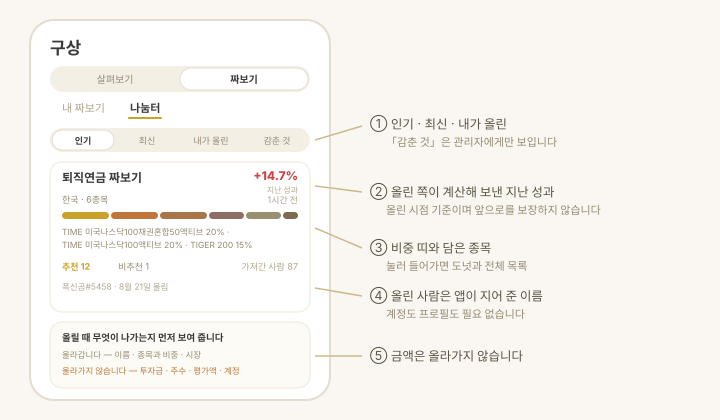

# 짜보기 · 나눔터

**구상** 탭은 둘로 갈립니다. **살펴보기**는 이미 가진 자산을 진단하는 자리이고
([살펴보기 문서](ai-review.html)), 여기 적은 **짜보기**는 아직 사지 않은 구성을
미리 짜 보는 자리입니다. **나눔터**는 남이 짜 본 구성을 보는 자리입니다.

> **자산 정보가 기기 밖으로 나가지 않습니다.** 주수 · 합성보수 · 지난 성과는 전부 앱
> 안에서 계산합니다. 밖으로 나가는 것은 종목을 찾고 시세를 받을 때의 **검색어와
> 종목 심볼**뿐입니다.

## 짜보기 — 아직 사지 않은 구성

> **1.3.0부터 쓸 수 있습니다.**

지금까지 앱은 **이미 가진 자산**만 봤습니다. "나스닥100을 담고 싶다"까지 정해도
TIGER · KODEX · ACE · RISE 가 각각 내놓은 판이 있고 환헤지 · 커버드콜 형제까지 붙는데,
그것을 한자리에 놓고 볼 곳이 없었습니다. 짜보기가 그 자리입니다.

**아직 실제 자산이 아닙니다.** 원장에 넣기 전까지 화면에
"아직 내 자산에 없습니다"라고 붙어 있습니다.

### 1. 짜보기를 먼저 만듭니다

목록에서 **새로 짜보기**를 누르고 이름과 **어느 시장에서 고를까요**(한국 · 미국 · 둘 다)를
정하면 빈 짜보기가 생깁니다. 시장은 **만든 뒤에 바꿀 수 없습니다.**
종목은 그 자리에서 **종목 담기**로 넣어도 되고, 나중에 **몇 번이든** 더 얹어도 됩니다 —
나스닥100을 담은 뒤 다시 채권 · 배당을 더할 수 있습니다.

> 화면에서는 이것을 **계좌라고 부르지 않습니다.** 진짜 증권계좌가 아닌데 계좌라고
> 하면 헷갈리기 때문입니다. **원장에 넣기**를 눌렀을 때 비로소 같은 이름의 계좌가
> 원장에 생깁니다.

목록이 집입니다. 줄마다 **담은 종목 수와 합성 보수**(그 값이 구성의 몇 %를 덮는지 함께),
그리고 원장에 넣었으면 **원장에 반영됨**이 보입니다. 줄에서 바로
**공유 · 복제**를 누르고, `⋯`로 **이름 바꾸기 · 삭제**를 합니다.
복제는 "같은 구성인데 환헤지 판으로도 해 보기"에 씁니다.
이름을 바꾸면 **원장에 넣었던 표시가 사라집니다**(이미 넣은 자산은 옛 이름 그대로 남습니다).

상세는 **보기가 기본이고 편집이 모드**입니다. 편집에서 [저장]을 눌러야 이번 편집분이
확정되고, [취소]로 되돌립니다. 지우더라도 **원장에 이미 넣은 자산은 지워지지 않습니다.**

### 2. 종목을 찾습니다

검색하면 후보를 **운용사별로 묶어** 보여줍니다(TIGER → 미래에셋, KODEX → 삼성,
ACE → 한국투자, RISE → KB …). 이름에서 유형 배지를 뽑아 답니다.

| 배지 | 뜻 |
| --- | --- |
| 환헤지 | 환율 변동을 상쇄하는 판 |
| 커버드콜 | 콜옵션을 팔아 분배금을 늘린 판 |
| 레버리지 · 인버스 | 지수 배수 · 반대 방향 |
| 월배당 | 분배를 다달이 |
| TR | 분배금을 재투자하는 판 |

### 3. 나란히 비교합니다

최대 다섯 개까지 골라 **비교하기**로 넘어갑니다. 항목이 행이고 ETF가 열입니다 —
아이폰에서는 옆으로 밀어서 봅니다(맥 · 아이패드는 한 번에 보입니다).

| 비교 항목 |
| --- |
| 총보수 · 배당률 · 순자산 · 추적오차 · 기초지수 |

- **정렬**은 보수 낮은 순 · 배당 높은 순 둘입니다. 앱이 점수를 매겨 줄 세우지 않습니다.
- 정확히 **둘**을 고르면 **상위 구성종목이 얼마나 겹치는지**도 냅니다.
  원천이 상위 10종목까지만 주므로 **전체 겹침이 아니라 그 범위 안의 값**이고,
  화면에 그 기준을 함께 적습니다.
- 기간을 골라 **수익률 곡선**을 겹쳐 봅니다.
- 표에서 바로 체크해 **담기**를 누릅니다. 담으면 **비중이 균등하게 나뉘고**, 편집에서 고칠 수 있습니다.

미국 종목은 원천에 추적오차가 없어 그 줄이 빕니다. 고장이 아닙니다.

### 4. 투자금을 넣어 봅니다

비중과 투자금을 넣으면 그 자리에서 계산합니다.

- 종목별 **주수**와 **남는 현금**
- **합성 보수** (그 값이 구성의 얼마를 덮고 있는지 함께 표시)
- **합성 섹터 비중** (정보기술 · 금융 … 큰 순서로)

투자금은 **원화 하나로** 받고 미국 종목은 현재 환율로 환산합니다(환율 기준을 화면에 적습니다).
시세나 환율을 못 받은 줄, 그 비중으로는 1주도 못 사는 줄은 **이유를 줄마다 적어 줍니다.**
금액 칸은 입력하는 중에 쉼표가 붙고 아래에 억 · 만 단위 한글 표기가 같이 뜹니다.

### 5. 지난 성과를 되짚습니다

상세의 **지난 성과 — 이 짜보기였다면**을 펼치면, 이 구성으로 그때 샀다면 어땠을지를
과거 시세로 되짚어 **누적 수익률 · 연환산 · 최대 낙폭**과 곡선으로 보여줍니다.
기간은 골라서 봅니다.

**예측이 아닙니다.** 이미 일어난 일을 이 구성에 맞춰 다시 계산한 값이고,
화면에도 그렇게 적혀 있습니다. 구간이 **90일이 안 되면 계산하지 않고**,
**1년이 안 되는 구간은 연환산 수익률을 내지 않습니다.**

### 6. 남에게 넘깁니다

상세의 **공유**(짜보기 공유)에서 세 가지로 보냅니다.

| 방법 | 내용 |
| --- | --- |
| 링크 | 누르면 앱이 열리고, 앱이 없는 사람은 웹 페이지에서 그대로 봅니다 |
| 코드 | `v1.`로 시작하는 짧은 글자. 받는 쪽은 목록의 **코드로 받기**에 붙여 넣습니다 |
| 그림 카드 | 4:5 한 장에 비중과 지난 성과가 함께 들어갑니다 |

구성은 링크 주소의 `#` 뒤에 실립니다. **URL 조각은 서버로 전송되지 않아** 저장되지도,
접속 기록에 남지도 않습니다. 카드를 공유하면 소개 문구도 같이 클립보드에 담깁니다.

받은 쪽은 종목 이름까지 미리 보고 이름을 정해 **내 짜보기로 저장**을 눌러야 목록에 들어갑니다.
남이 보낸 코드는 앱이 곧이곧대로 믿지 않고 값의 범위를 다시 검사합니다.

### 7. 마음에 들면 원장에 넣습니다

**원장에 넣기**로 진짜 계좌를 만듭니다.

- **사본이 갑니다** — 넣은 뒤에 짜보기를 고쳐도 원장은 따라 바뀌지 않습니다.
- 짜보기 이름 그대로 **원장의 계좌 하나**가 됩니다.
- 한 번 넣은 것은 **원장에 반영됨**으로 표시돼 두 번 넣는 사고를 막습니다.
- 시세를 못 받아 **수량이 0이 된 줄은 들어가지 않습니다.**

## 나눔터 — 다른 사람이 짜 본 조합

> **1.4.0부터 쓸 수 있습니다.**

1.3.0의 공유는 **링크를 아는 사람끼리만** 오갔습니다. 나눔터는 모르는 사람의 짜보기를
발견하는 자리입니다. 「짜보기」 화면 맨 위 **[내 짜보기 | 나눔터]** 에서 넘어갑니다.

**게시판이 아닙니다.** 올라가는 것은 글이 아니라 짜보기 하나입니다.

| 올라갑니다 | 올라가지 않습니다 |
|---|---|
| 종목과 비중 | **투자금·주수·평가액** |
| 짜보기 이름 | 본문·댓글·사진 |
| 시장 구분(국내·미국·둘 다) | 계정·이메일·기기 정보 |

올린 사람은 `돌돌이#4821` 같은 이름으로 보입니다. **직접 짓는 이름이 아니라** 앱이
기기에서 만들어 붙이는 것이라, 아무 말이나 적어 올릴 수 없습니다.

### 보고, 가져오고, 신고합니다

- **보기** — [인기 · 최신 · 내가 올린]으로 고릅니다. 조합을 누르면 종목 비중과
  「지난 1년」 성과가 나옵니다. 지난 값이며 앞으로를 보장하지 않습니다.
- **가져오기** — [내 짜보기로 가져가기]를 누르면 **링크로 받았을 때와 같은 확인
  화면**이 뜹니다. 저장을 눌러야 내 목록에 생기고, 원장에는 자동으로 안 들어갑니다.
- **올리기** — 내 짜보기 상세의 [나눔터에 올리기]. 무엇이 올라가고 무엇이 안 올라가는지
  먼저 보여 드립니다. 하루 세 개까지 올릴 수 있고, 내가 올린 것은 언제든 내릴 수 있습니다.
- **신고** — 부적절한 조합은 신고할 수 있고, 여러 사람이 신고하면 목록에서 사라집니다.

### 앱이 없어도 볼 수 있습니다

[사람들이 짜 본 조합](../c/)에서 앱 설치 없이 바로 봅니다.
